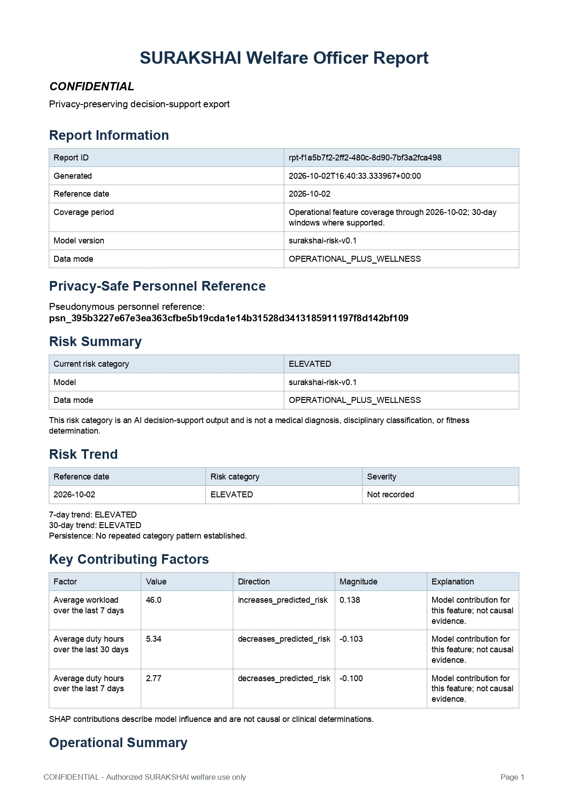
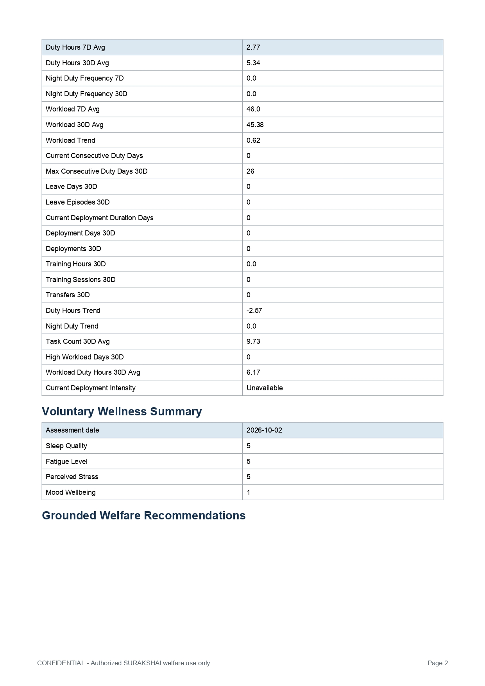
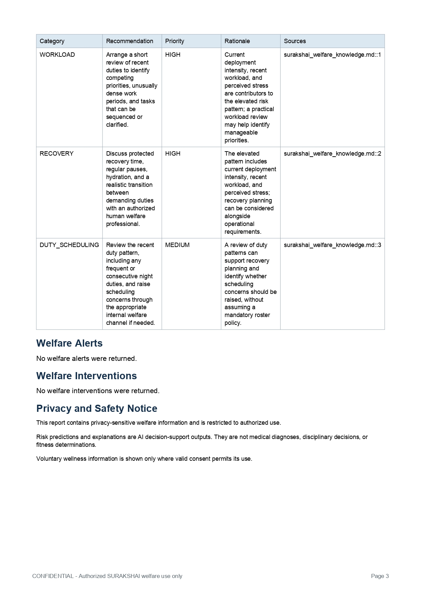

# ML Stress Engine for CAPF Personnel

An ML-focused decision-support engine for longitudinal operational data and authorized, voluntary wellness check-ins. It engineers time-bounded features, scores them with a multiclass XGBoost model, explains each result with SHAP, and supports persistence-based welfare review. Human authorization remains part of every workflow.


  


## ML engine at a glance

| Area | Implementation |
| --- | --- |
| Longitudinal input | Duty, workload, leave, deployment, training, and transfer history, computed as of a requested reference date |
| Optional input | Latest eligible voluntary wellness assessment, only with current processing consent |
| Feature contract | Ordered 31-feature numeric vector; versioned and validated before inference |
| Estimator | XGBoost multiclass classifier with `LOW`, `ELEVATED`, and `HIGH` output classes |
| Explanation | Backend SHAP TreeExplainer; ranked signed contributions for the predicted class |
| Alert policy | Repeated-observation thresholds, unresolved-alert suppression/escalation, and cooldown |
| Candidate lifecycle | Admin plan and confirmation, queued worker, isolated candidate artifact, validation, explicit promotion and rollback |
| Persistence | Existing MongoDB Atlas deployment; database access stays in Flask |

The repository also includes a React/TypeScript interface for personnel, welfare staff, commanders, and administrators. The UI is a client for the ML and workflow APIs; inference, feature construction, consent, authorization, and persistence are backend responsibilities.

## Engine architecture

```text
Authorized request + reference date
                 │
                 ▼
Flask identity / role / personnel-scope / consent checks
                 │
                 ├── Atlas repositories: operational history + eligible wellness
                 │
                 ▼
Longitudinal feature engineering (as-of date; 7-day and 30-day windows)
                 │
                 ▼
Canonical feature adapter (31 ordered values; missingness and consent encoded)
                 │
                 ▼
Active XGBoost ──► class probabilities + LOW / ELEVATED / HIGH
       │
       ├── SHAP TreeExplainer ──► top signed contributions on request
       └── Alert persistence policy ──► human review workflow when criteria hold
```

The browser does not connect directly to Atlas or run XGBoost/SHAP. Flask is the authorization, feature, inference, and data-access boundary. Frontend route guards are for navigation only; the API checks every protected request and personnel scope.

### Supporting services

- Recommendations retrieve passages from the local welfare knowledge base and may use an optional server-side OpenAI-compatible provider. Responses carry source references and require human review.
- Reports present privacy-aware risk, trend, contribution, operational, eligible wellness, recommendation, alert, and intervention sections.
- Atlas persists operational and workflow data. The candidate worker and API must share the configured Atlas database and durable model artifact directory.

### Request-to-prediction flow

1. The API validates identity, role, linked personnel scope, and the requested reference date.
2. Repositories load only that person's operational records with event dates and creation times no later than the reference date.
3. The feature service computes longitudinal values; the wellness service supplies a record only when current consent allows it and the assessment is not after the reference date.
4. The adapter maps service fields into the model's exact ordered schema, normalizes supported category values, and marks unavailable inputs as missing.
5. The active model returns probabilities and a class. The API records a minimized audit event with actor, model version, data mode, and reference date.
6. Explanation, recommendations, and alert evaluation are separate operations. They do not silently create an intervention or automatically act on a person.


The following supplied screenshots show a three-page generated welfare report, including its risk summary, model contributions, operational summary, recommendations, alert/intervention sections, and privacy notice.

> The report is marked confidential and includes pseudonymous and wellness-related example data. Treat these screenshots as sensitive project material. Do not replace them with reports containing real personnel information or publish them outside an audience authorized to view them.

<details>
<summary>Page 1 — report identity, risk summary, trends, and contributors</summary>


</details>

<details>
<summary>Page 2 — operational and voluntary wellness summary</summary>


</details>

<details>
<summary>Page 3 — recommendations, alert/intervention status, and privacy notice</summary>


</details>

## Longitudinal feature engineering

The feature pipeline is implemented in `stress-management-engine-backend/src/features/feature_engineering.py`, with database orchestration in `src/features/feature_service.py`. It is deterministic for a given personnel record set and reference date. Every source record must belong to the requested personnel member, have a valid event date, and be dated no later than the reference date. When a `created_at` timestamp exists, it must also be no later than that date. This as-of filtering prevents future records from leaking into a historical score.

Windows are calendar-day windows including the reference date: seven days and thirty days. Daily records are aggregated by day where appropriate; trends compare the recent seven-day calculation with its 30-day counterpart. Unavailable history remains missing (`None`/`NaN`) rather than being silently treated as zero. The estimator handles missing values; training-time imputation uses medians fit on the training partition only.

Examples of the temporal calculations:

- Duty hours are summed by day, then divided by the full window length for the 7-day/30-day average. Night-duty frequency is night-duty days divided by observed duty days; a day with multiple records counts once.
- Workload and task summaries first aggregate records by date. Workload means average observed daily scores; `high_workload_days_30d` counts dates whose highest daily workload score is at least `70`.
- The current duty streak counts consecutive duty dates ending on the reference date. The 30-day maximum finds the longest consecutive run in that window.
- `workload_trend`, `duty_hours_trend`, and `night_duty_trend` are the 7-day value minus the corresponding 30-day value. They are missing if either side is unavailable.
- Leave and deployment date ranges are clipped to the 30-day window and counted by overlapping days. Training hours are prorated across the overlap of completed training sessions with the window.

### Canonical 31-feature contract

The model receives exactly this ordered schema from `src/ml/feature_schema.py`. Personnel IDs, dates, split markers, and the target label are metadata, never model inputs.

| Group | Features | Meaning |
| --- | --- | --- |
| Duty and schedule | `duty_hours_7d_avg`, `duty_hours_30d_avg`, `night_duty_7d_count`, `night_duty_30d_count`, `night_duty_frequency_7d`, `night_duty_frequency_30d` | Average duty hours, night-duty days, and night-duty share of duty days in short and baseline windows |
| Workload | `workload_7d_avg`, `workload_30d_avg`, `workload_trend`, `average_tasks_30d`, `high_workload_days_30d`, `workload_duty_hours_mean_30d` | Mean workload, 7-day minus 30-day workload, tasks, high-workload days, and workload-record duty-hour average |
| Duty continuity and trend | `current_consecutive_duty_days`, `max_consecutive_duty_days_30d`, `duty_hours_trend`, `night_duty_trend` | Current duty streak, longest 30-day streak, and recent-minus-baseline duty-hour/night-duty rates |
| Leave | `days_since_most_recent_leave`, `leave_days_30d`, `leave_episodes_30d` | Days since latest completed leave and leave days/episodes overlapping the 30-day window |
| Deployment | `current_deployment_days`, `deployment_days_30d`, `deployment_count_30d`, `deployment_intensity_current` | Current assignment duration, deployment-day union and episodes in 30 days, and current intensity |
| Training and movement | `training_hours_30d`, `training_session_count_30d`, `transfer_count_30d` | Completed training hours/sessions and transfer events in the 30-day window |
| Voluntary wellness | `sleep_quality`, `fatigue_level`, `perceived_stress`, `mood_wellbeing`, `wellness_available` | Latest eligible self-report plus an indicator that consented wellness data was available |

The vector adapter in `src/ml/risk_features.py` validates field order and length, handles source aliases, converts deployment intensity (`LOW` through `VERY_HIGH`) to numeric levels, and rejects non-finite/unparseable values into missing values. When there is no authorized wellness record, all four wellness measurements are `NaN` and `wellness_available` is `0`; with an eligible, consented record the measurements are mapped and the indicator is `1`. Operational-only and operational-plus-wellness data modes are reported explicitly.

### Inference contract

`src/ml/risk_model.py` loads the baseline artifact (or explicitly selected active candidate), then checks the feature list, feature count, feature version, target-class map, and loaded model input size. Predictions return probabilities for `LOW`, `ELEVATED`, and `HIGH`, the selected class, model version, reference date, and data mode. The class order and names are fixed by the model metadata contract. Model loading fails closed when artifacts or metadata do not match the canonical schema.

### Training and candidate governance

The bundled synthetic dataset is `stress-management-engine-backend/data/surakshai_phase4_synthetic_risk_dataset.csv`. Training uses its predefined `TRAIN`, `VALIDATION`, and `TEST` partitions; preprocessing statistics are fit on training data and then applied without fitting on validation/test rows. Training can be initiated through the admin lifecycle or a development-only direct script.

The admin lifecycle (`src/ml/training_service.py`) validates an allow-listed configuration, creates a persistent job after explicit confirmation, and leaves execution to `scripts/run_model_training_worker.py`. A worker writes candidate artifacts separately from the baseline and validates successful completion, feature compatibility, class mapping, metrics, and artifact loadability. A candidate never becomes active automatically. Promotion is an explicit admin action; the active pointer and rollback state are managed separately from candidate output.

The checked-in baseline metadata records approximately 0.567 accuracy, 0.570 macro precision, 0.527 macro recall, and 0.518 macro-F1; per-class F1 is 0.649 LOW, 0.625 ELEVATED, and 0.279 HIGH. These are historical results on synthetic data, not deployment or clinical performance. A development candidate may have different metrics; review its own metadata rather than treating baseline results as a guarantee.

### SHAP explanations

`src/ml/shap_explainer.py` creates a cached `shap.TreeExplainer` for the loaded XGBoost estimator. For the same canonical feature vector used for prediction, it selects the SHAP values for the predicted class, normalizes supported SHAP output layouts, and ranks up to five contributions by absolute magnitude. Each result includes a feature key and label, signed `shap_value`, and direction (`increases_predicted_risk` or `decreases_predicted_risk`). Ties retain canonical schema order for stable display. Explanation requests are audited independently from prediction requests.

SHAP is a model-attribution method: the signed value describes the feature's contribution to this model output relative to its baseline. With the current TreeExplainer defaults for XGBoost, values are in the estimator's raw output space (margin), not percentage points of class probability. SHAP is not a causal effect, clinical explanation, or proof that a factor caused a person's state. Read it alongside input coverage, data mode, reference date, and model version.

### Persistence-based alerts and human review

`src/welfare/alert_policy.py` separates risk scoring from alert qualification. Defaults require two observations of `HIGH` or two of `ELEVATED` within a seven-day persistence window. Repeated `HIGH` maps to `PRIORITY`; repeated `ELEVATED` maps to `ATTENTION`. An unresolved duplicate is suppressed, an existing lower-severity alert can be escalated when higher criteria hold, and a seven-day cooldown applies to new alerts. These settings are configurable in the backend environment. Alert evaluation is a workflow signal; it does not create an intervention automatically. Staff actions and intervention status changes require authorized API operations.

### Model and use limitations

Risk categories and SHAP values describe model output; they do not establish causes or a person's clinical state. The bundled dataset is synthetic and its metrics are not evidence of field performance. Before any operational use, the model would need independent data provenance and label review, leakage and split audits, subgroup and calibration analysis, prospective validation, threshold review, and qualified governance. It must not be used for diagnosis, discipline, employment, or fitness decisions.

## Access roles

| Role | Authorized scope |
| --- | --- | --- |
| `PERSONNEL` | Own risk, history, explanation, consent, voluntary wellness, support, recommendations, and report |
| `WELFARE_OFFICER` | Authorized aggregate and case review; human-managed alert, support, and intervention workflows |
| `COMMANDER` | Aggregate operational summary; no individual case or wellness access |
| `ADMIN` | User administration and explicit model-training lifecycle actions |

Flask enforces actual access on every API request. The React/Vite frontend is a thin role-based interface and is not a security control.

## Local development setup

### Requirements

- Python 3.10 or newer and pip
- Node.js/npm compatible with the Vite version in the frontend lockfile
- Access to the **existing MongoDB Atlas deployment** and its development/staging database

This project uses Atlas. Do not install or start local MongoDB, create a second database, or replace Atlas with a local/Docker database. Keep the existing Atlas URI in the backend's private `.env` or environment configuration; never paste it into this README, source code, screenshots, or frontend variables.

### 1. Configure the backend

From the repository root, create a backend virtual environment and install the pinned backend requirements:

```powershell
cd stress-management-engine-backend
py -3 -m venv .venv
.\.venv\Scripts\Activate.ps1
python -m pip install --upgrade pip
pip install -r requirements.txt
Copy-Item .env.example .env
```

Edit `stress-management-engine-backend/.env` locally. Set `MONGODB_URI` to the already authorized Atlas connection and `MONGODB_DATABASE` to the existing development/staging database. Configure distinct development values for `JWT_SECRET_KEY` and `PSEUDONYMIZATION_SECRET`, and include the frontend origin in `CORS_ALLOWED_ORIGINS`. Do not commit `.env`. Do not copy live credentials into examples or issue reports.

The checked-in `.env.example` is a template, not a working Atlas configuration. Review every database setting before starting the API; do not use its placeholder/local URI as a replacement for the existing Atlas deployment.

### 2. Optionally enable development demo accounts

Demo accounts are created only when both conditions hold:

```dotenv
APP_ENV=development
SURAKSHAI_ENABLE_DEV_USER_SEED=1
```

The backend needs a working Atlas connection before it can persist or authenticate these users. Seeding skips usernames that already exist. A personnel account is linked only if its personnel record exists at bootstrap time; otherwise it may be created without a personnel link and personnel-specific routes will not work. Do not enable this setting in production or use these passwords with real data.

### 3. Start the Flask API

In the backend directory, with the virtual environment active:

```powershell
python api_server.py
```

The default local API address is `http://localhost:5000`. `GET /health` checks Flask liveness only; it does not prove Atlas connectivity. Verify database access by signing in and using an authenticated, database-backed endpoint.

### 4. Optional web interface

The React/Vite client is optional for API and model development. In a second terminal:

```powershell
cd stress-management-engine-frontend
npm ci
npm run dev
```

The Vite development address is normally `http://localhost:5173`. `VITE_API_BASE_URL` selects the Flask API origin. Frontend configuration is browser-visible; never put database credentials, JWT signing secrets, or provider keys in it.

### 5. Optional model-training worker

Administrator-confirmed training jobs require the worker to run separately from Flask:

```powershell
cd stress-management-engine-backend
.\.venv\Scripts\Activate.ps1
python scripts/run_model_training_worker.py
```

The worker and API must share the same Atlas database and durable model-artifact storage. A successful job produces a candidate that still requires explicit review and promotion.

## Development demo accounts

The `DEVELOPMENT_USERS` mapping in `stress-management-engine-backend/src/security/demo_users.py` defines these hard-coded development fixtures. They are **not production accounts or secrets suitable for deployment**. Use them only with `APP_ENV=development`, an isolated development/staging Atlas database, and no real personnel records. Change or remove them before exposing any environment to an untrusted network.

| Username | Role | Personnel link | Development password |
| --- | --- | --- | --- |
| `demo_personnel` | `PERSONNEL` | `P001` when that personnel record exists | `demo-personnel-password` |
| `mock_personnel` | `PERSONNEL` | `P900` when that personnel record exists | `SurakshAI@Personnel2026!` |
| `demo_welfare` | `WELFARE_OFFICER` | — | `demo-welfare-password` |
| `demo_commander` | `COMMANDER` | — | `demo-commander-password` |
| `demo_admin` | `ADMIN` | — | `demo-admin-password` |

These are bootstrap definitions: account creation is opt-in and database-backed. If an account already exists, bootstrap leaves it unchanged, including its password. If `P001` or `P900` is absent from the selected database, the corresponding personnel account can exist without a linked personnel record. Never assume demo accounts exist in Atlas until development seeding has been enabled and the login has been verified.

## Configuration and security

The backend loads `stress-management-engine-backend/.env`; process environment variables take precedence. The complete configuration reference is in the [backend README](stress-management-engine-backend/README.md#configuration). Important settings include:

| Setting | Purpose |
| --- | --- |
| `APP_ENV` | `development`, `test`, or `production`; demo bootstrap is allowed only in development. |
| `MONGODB_URI`, `MONGODB_DATABASE` | Existing Atlas connection and the selected database. Keep the URI secret. |
| `JWT_SECRET_KEY`, `PSEUDONYMIZATION_SECRET` | Backend-only secrets; use distinct, random values. |
| `CORS_ALLOWED_ORIGINS` | Explicit browser-origin allowlist; production requires HTTPS origins. |
| `VITE_API_BASE_URL` | Public frontend setting for the Flask API origin only. |
| `SURAKSHAI_LLM_BASE_URL`, `SURAKSHAI_LLM_MODEL`, `SURAKSHAI_LLM_API_KEY` | Optional server-side recommendation provider configuration. Keep the API key out of the frontend. |

The current code retains some legacy internal names in model metadata, environment variables, routes, and paths. Those names are implementation identifiers; this project's user-facing name in this README is **ML Stress Engine for CAPF Personnel**.

The frontend stores the access token in tab-scoped `sessionStorage`, sends it as a bearer token, and clears protected state on an unauthorized response. The backend applies authentication, role checks, ownership checks, consent rules, validation, and audit logging. Do not weaken those checks to make a demo account work.

## Tests and build

From the frontend directory:

```powershell
npm run typecheck
npm run build
```

From the backend directory, with its virtual environment active:

```powershell
python -m unittest discover -s tests -p "test_*.py" -v
```

The frontend currently defines typecheck, build, development, and preview scripts; it does not define an npm test or lint script. Do not run synthetic staging seed/reset scripts against production or an Atlas database containing unrelated data.

## Repository map

| Path | Purpose |
| --- | --- |
| `stress-management-engine-frontend/` | React/TypeScript web application |
| `stress-management-engine-backend/api_server.py` | Flask routes and API composition |
| `stress-management-engine-backend/src/security/` | Authentication, consent, authorization, audit, and demo fixtures |
| `stress-management-engine-backend/src/features/` | Operational feature generation |
| `stress-management-engine-backend/src/ml/` | Feature contract, model inference, SHAP, retrieval, and training lifecycle |
| `stress-management-engine-backend/src/welfare/` | Alert, support, intervention, and welfare repositories/workflows |
| `stress-management-engine-backend/src/reports/` | Privacy-aware report generation |
| `stress-management-engine-backend/models/risk/` | Baseline model and metadata; runtime-managed candidate/active state |
| `stress-management-engine-backend/scripts/` | Development seed and worker commands |
| `stress-management-engine-backend/tests/` | Python API, security, persistence, and model tests |
| `docs/proof-of-work/` | Supplied report screenshots shown above |

## Further documentation

- [Backend dependencies](stress-management-engine-backend/requirements.txt)
- [Canonical model feature schema](stress-management-engine-backend/src/ml/feature_schema.py)
- [Baseline model metadata](stress-management-engine-backend/models/risk/metadata.json)
